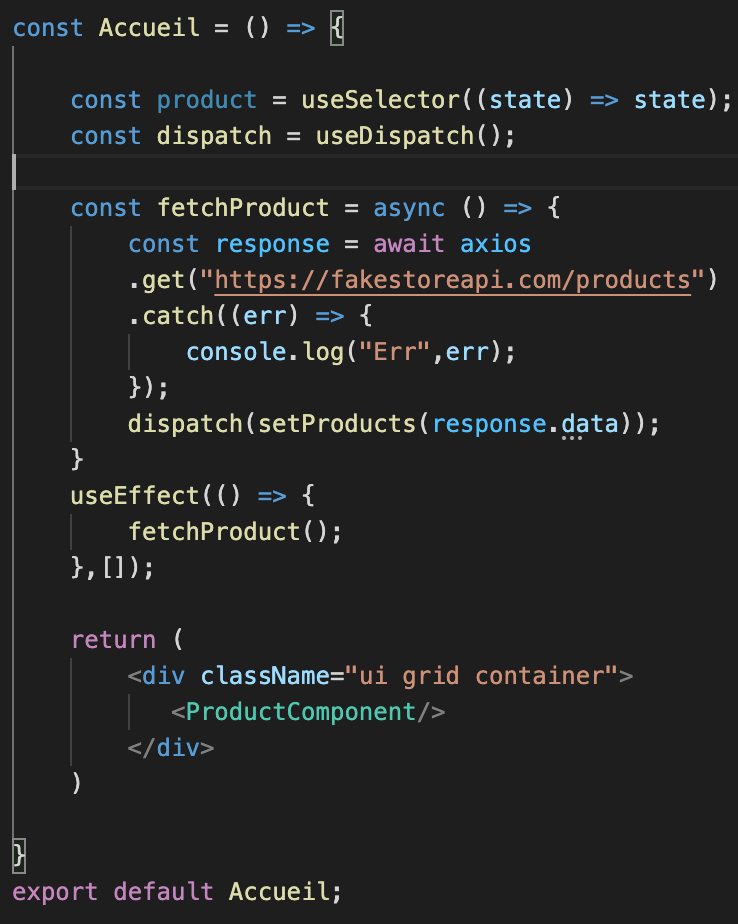
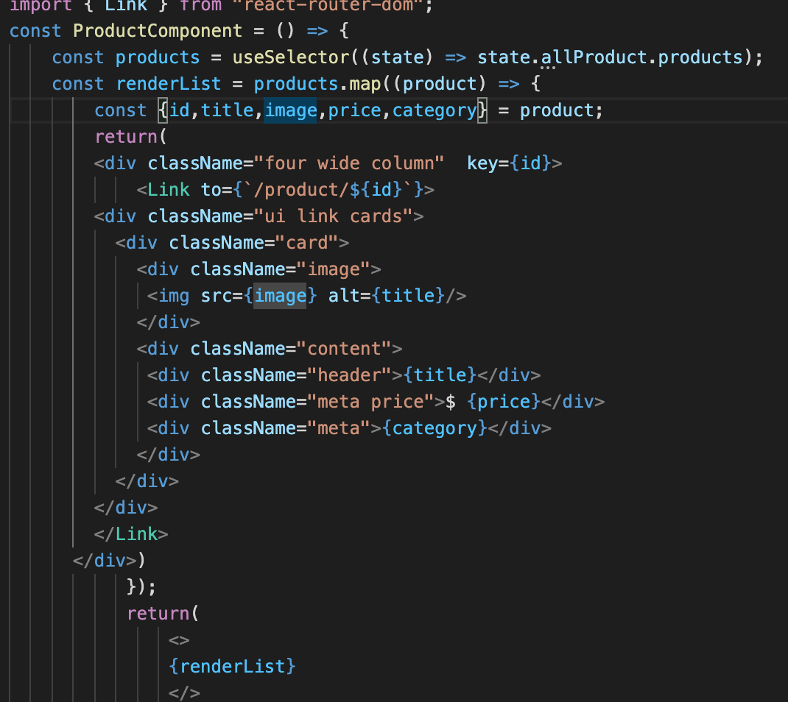
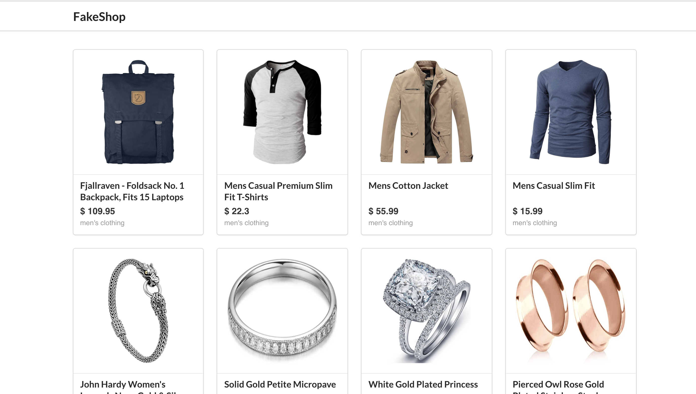
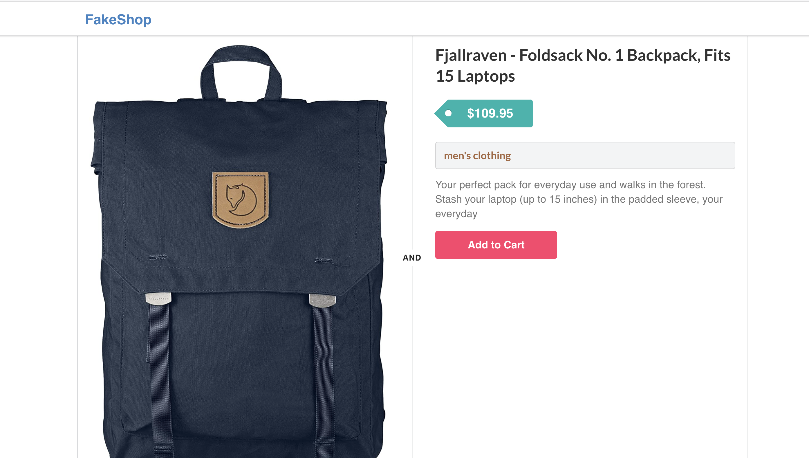

# Getting Started with Create React App

This project was bootstrapped with [Create React App](https://github.com/facebook/create-react-app).

## Available Scripts

In the project directory, you can run:

### `npm start`

Runs the app in the development mode.\
Open [http://localhost:3000](http://localhost:3000) to view it in the browser.

The page will reload if you make edits.\
You will also see any lint errors in the console.

### `install react-router-dom`

npm install --save react-router-dom

### `install axios`

npm install axios
Axios is based on Promise, which allows you to take advantage of the async benefits of JavaScript and await for more readable asynchronous code.

### `install redux`

npm install react-redux
Redux is a predictable state container for JavaScript apps. It’s a « state container » because it holds all the state of your application. It doesn’t let you change that state directly, but instead forces you to describe changes as plain objects called « actions ». Actions can be recorded and replayed later, so this makes state management predictable. With the same actions in the same order, you’re going to end up in the same state.

### `integrate semantic ui in index.html `

Semantic is a development framework that helps create beautiful, responsive layouts using human-friendly HTML.

### `create component folder and file `

### `affiche data `

https://fakestoreapi.com/docs

### `create  SET_PRODUCTS :"SET_PRODUCTS" in constan folder `

export const ActionTypes = {
    SET_PRODUCTS :"SET_PRODUCTS",
}

### `create product reducer productReducers `

import { ActionTypes } from "../constants/actionTypes";

const initialState = {
    products :[],
}

export const productReducers = (state = initialState , {type,payload}) => {
    switch(type){
        case(ActionTypes.SET_PRODUCTS):
            return {
            ...state,
            products :payload
            }
        default:
            return state

        }
    };

### `CREATE ACTION `

import { ActionTypes } from "../constants/actionTypes";
export const setProducts = (products) => {
    return {
        type : ActionTypes.SET_PRODUCTS,
        payload:products,
    };
}; 

### `use axios and useSelector and usedispatch to get data from url` 

### `display data `

### `show data on your website`
 
 

### `detail of product`

 

 